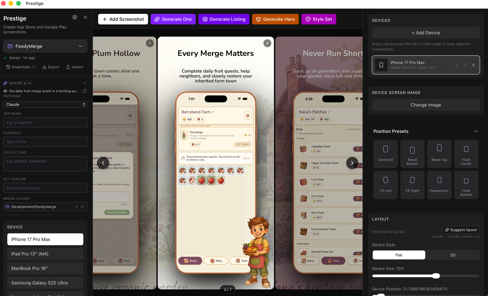

<p align="center">
  
</p>

<h1 align="center">Prestige</h1>

<p align="center">App Store screenshot generator — design polished marketing visuals with realistic device mockups, 3D rendering, multi-device compositions, AI-assisted content generation, and batch export.</p>

<p align="center">
  <a href="https://prestige.inceptyonlabs.com/">prestige.inceptyonlabs.com</a>
</p>

<p align="center">
  
  
  
  
  
</p>



## Overview

Prestige is a desktop-first app for crafting App Store and Google Play marketing screenshots. It runs as a native Tauri app on macOS (with full web build for the browser). Beyond the usual device frames and text overlays, Prestige plugs into your local Claude / Codex / Gemini CLIs to generate full panel sets, hero covers, listing copy, layouts, and imagery — no API keys, no cloud round-trips, just your existing subscriptions.

## Features

###  Devices & Frames

- **5 device frames** — iPhone 17 Pro Max, iPad Pro 13" (M4), MacBook Pro 16", Samsung Galaxy S25 Ultra, Samsung Galaxy Tab S10+
- **Authentic color options** — Cosmic Orange, Deep Blue, Silver, Natural Titanium, Black Titanium, White Titanium, Space Black, Midnight, Starlight, Titanium Jet Black, and more, matched per device
- **Multi-device compositions** — add, select, reorder, and style multiple independent devices inside a single screenshot
- **Independent device instances** — each device keeps its own screen image, model, color, transform, 3D angles, and shadow
- **Cross-screen device overflow** — drag devices past the left or right edge to continue them into adjacent screenshots
- **Flat & 3D rendering modes** — toggle between a classic 2D frame and a perspective 3D view with visible device edges
- **3D rotation controls** — adjust Rotate Y and Rotate X angles for the perfect perspective
- **Accurate camera elements** — Dynamic Island, notch, and punch-hole camera matched to each device

###  AI-Powered Generation

- **Generate One** — give a single-line idea ("the home dashboard with daily streaks") and Prestige scaffolds a complete panel: headline, subheadline, background, text color, font
- **Generate Listing** — produce a coherent N-panel App Store listing in one pass, with a shared theme and a sequenced story (hero → features → social proof / CTA)
- **Generate Hero** — produce a cover panel: evocative headline, subheadline, and an AI-generated atmospheric background image, all derived from brand context
- **Style Set** — apply a varied-but-coherent visual treatment across all existing panels (one shared font, palette-progressing backgrounds, contrast-tuned text)
- **Suggest Layout** — AI picks the best position preset for each panel based on brand voice and screen content
- **Suggest content & image prompts** — inline `Suggest` helpers next to headline, subheadline, and image-prompt inputs return 3–6 brand-aware candidates to click into place
- **Image generation** — generate spanning backgrounds and overlay imagery via Nano Banana Pro (Gemini 3 Pro Image) directly from prompts, with brand-context enrichment

###  Multi-Provider AI

- **Three providers** — Claude, Codex, and Gemini via their local CLIs (`claude`, `codex`, `gemini`) — no API keys needed, uses your existing subscriptions
- **Two-tier model selection per provider** — choose a *default* model for big-effort generation (full screenshot, listing, hero, theme, layout) and a *cheap* model for assistive tasks (prompt suggestions, vision descriptions) so flagship spend goes only where it matters
- **Optional Gemini image API** — if you'd rather use the Gemini Image API directly with a key (instead of the local CLI path), enable it in Settings
- **Settings modal** — enable/disable each provider, set model tiers, manage API keys for image providers; persisted to `$APPDATA/settings.json`

###  Brand Context

- **Brand folder picker** — point Prestige at a folder of brand assets (style guides, palette files, voice docs, sample copy) and every AI call gets it as context
- **Structured brand fields** — App Name, Audience, Voice / Tone, Key Feature — short inputs that compose into the system prompt so the AI always knows who it's writing for
- **Composed prompts** — generation features merge folder contents + structured fields + screen content into one rich brief, so output stays on-brand without prompt engineering each time

###  Backgrounds & Appearance

- **Solid color backgrounds** with a full color picker
- **Gradient presets** — Sunset, Ocean, Mint, Berry, Royal, Rose
- **AI-generated background images** — spanning images that flow across multi-panel listings
- **Global text color picker**

###  Rich Text & Fonts

- **Rich text editor** for headlines and subheadlines — bold, italic, underline, text color, alignment (left/center/right), and text background highlights
- **Rounded highlight styling** — highlighted text uses padded, rounded backgrounds that match in the editor, preview, and export
- **Google Fonts integration** — search and preview hundreds of fonts
- **Independent sizing** — separate font size sliders for headline and subheadline
- **Width control** — set how wide each text block spans
- **Drag-to-reposition** — click and drag headlines or subheadlines anywhere on the canvas

###  Overlay Images

- **Unlimited overlay images** — upload badges, logos, arrows, or decorations
- **Drag-to-reposition** and **resize** with width percentage control
- **Rotation control** per image
- **Layer management** — place behind or in front of the device, reorder with bring forward/backward/to-front/to-back
- **Per-image shadow** — enable/disable with color, blur, and offset controls

###  Layout & Positioning

- **8 position presets** — Centered, Bleed Bottom, Bleed Top, Float Center, Float Bottom, Tilt Left, Tilt Right, Perspective
- **Device size** slider (scale %)
- **Device vertical position** slider (offset %)
- **Device rotation** (flat mode) or **3D rotation** (3D mode)
- **Device shadow** — toggle on/off with color, blur, and vertical offset controls

###  Snap-to-Guides

- **Drag-time alignment guides** — when you drag any element, Prestige shows alignment lines for canvas centers, edges, and other elements on the same panel
- **Cross-panel snap** — guides extend to *adjacent* screenshot cards so multi-panel layouts line up perfectly without measurement
- **Auto-snap threshold** — elements snap when they land within ~1.5% of an alignment target

###  Project Management

- **Multiple projects** — create, rename, switch between, and delete projects
- **Dual-build storage** — IndexedDB in the web build (gigabyte-scale capacity); native filesystem in the Tauri build (under `$APPDATA/io.inceptyonlabs.prestige/`)
- **Auto-save with live status** — debounced writes after every change, with an inline "Saving… / Saved · 2s ago" indicator next to the project switcher. Click the indicator to force an immediate save
- **Named snapshots** — freeze the current project as a named version before risky edits, then restore or delete it from the Snapshots panel
- **Export / Import** — download the active project as a portable `.prestige.json` file (full state, including base64 screenshots and overlays) and re-import it on another machine or as a backup
- **Reset to defaults** — clear storage and start fresh
- **Resizable sidebars** — drag-to-resize the left and right panels; widths persist per workspace

###  Export

- **Batch export** — export all screenshots at once (ZIP for multiple, PNG for single)
- **5 export size presets** — iPhone 6.9", iPad 13", Mac, Android phone, Android tablet 10"
- **Full 3D support** — 3D perspective, edges, and shadows are preserved in exports
- **Cross-screen layouts preserved** — multi-device overflow compositions export exactly like the on-canvas preview
- **Pixel-perfect** — exported images match the on-screen preview
- **Export toast** — non-blocking confirmation with a quick "open output folder" action

###  Editor Experience

- **Multi-screenshot gallery** — add, remove, and navigate screenshots in a horizontal carousel
- **Real-time preview** — all changes update instantly on the canvas
- **Drag-and-drop** — reposition any element by dragging directly on the canvas
- **Device manager** — add, select, remove, and reorder devices from the right sidebar
- **Element selection** — click to select text, devices, or overlay images with visual feedback
- **Helpful rich-text tooltips** — formatting controls include hover/focus tooltips
- **Dark mode UI** — sleek dark interface that's easy on the eyes

##  Quick Start

### Prerequisites

- [Bun](https://bun.sh/) (recommended) or Node.js 18+
- For the desktop build: [Rust](https://www.rust-lang.org/tools/install) and platform Tauri prerequisites — see the [Tauri prerequisites guide](https://tauri.app/start/prerequisites/)
- For AI features: at least one of the CLIs on PATH — [`claude`](https://docs.claude.com/en/docs/claude-code), [`codex`](https://github.com/openai/codex), or [`gemini`](https://github.com/google-gemini/gemini-cli)

### Installation

```bash
# Clone the repository
git clone https://github.com/inceptyon-labs/prestige.git
cd prestige

# Install dependencies
bun install

# Start the web dev server
bun run dev

# Or start the Tauri desktop app
bun run tauri dev
```

The web app will be available at `http://localhost:5173`. The Tauri build opens a native window.

### Building for Production

```bash
# Web build
bun run build

# Desktop build (.dmg on macOS)
bun run tauri build
```

Web build outputs to `dist/`; desktop bundles output to `src-tauri/target/release/bundle/`.

##  Tech Stack

- **Desktop shell**: [Tauri 2](https://tauri.app/) (Rust)
- **Framework**: [React 19](https://react.dev/)
- **Routing**: [TanStack Router](https://tanstack.com/router)
- **Styling**: [Tailwind CSS 4](https://tailwindcss.com/)
- **Icons**: [Lucide React](https://lucide.dev/)
- **UI Components**: [shadcn/ui](https://ui.shadcn.com/)
- **Build Tool**: [Vite 7](https://vitejs.dev/)
- **Testing**: [Vitest](https://vitest.dev/)
- **Runtime**: [Bun](https://bun.sh/)
- **AI**: local CLIs ([Claude Code](https://docs.claude.com/en/docs/claude-code), [Codex](https://github.com/openai/codex), [Gemini CLI](https://github.com/google-gemini/gemini-cli)) + optional Gemini Image API

##  Project Structure

```
src/
├── components/
│   ├── AISuggest/                  # Inline AI suggestion helpers
│   ├── CanvasPreview/              # Main canvas, screenshot cards, snap guides
│   ├── DeviceFrame/                # Device mockups (flat 2D & 3D with edges)
│   ├── ExportToast.tsx             # Post-export confirmation toast
│   ├── FontPicker/                 # Google Fonts search & selection
│   ├── GenerateHeroModal/          # AI hero-cover generation
│   ├── GenerateImageModal/         # AI image generation (backgrounds, overlays)
│   ├── GenerateListingModal/       # AI N-panel listing generation
│   ├── GenerateScreenshotModal/    # AI single-panel generation
│   ├── LeftSidebar/                # Device picker, brand context, AI controls, export
│   ├── ProjectSwitcher/            # Project management, snapshots, import/export
│   ├── ResizeHandle.tsx            # Sidebar resize handle
│   ├── RichTextEditor/             # Rich text formatting toolbar & editor
│   ├── RightSidebar/               # Layout, appearance, content, device, overlay controls
│   ├── SettingsModal/              # Provider tiers, API keys, image-gen settings
│   ├── StyleSetModal/              # AI cross-panel visual coherence
│   ├── EditorLayout.tsx            # Main editor layout shell
│   └── ui/                         # shadcn/ui components
├── context/
│   └── EditorContext.tsx           # Global editor state & actions
├── lib/
│   ├── ai/
│   │   ├── api/                    # Direct-API providers (Claude / Gemini / OpenAI text APIs)
│   │   ├── features/               # Discrete AI features (full-screenshot, listing, hero, style-set, layout, vision, image-prompts, content-pair, theme, enrich-image-prompt)
│   │   ├── image/                  # Image-gen providers (nano-banana script, gemini-api, codex-image, slice, workspace)
│   │   ├── brand.ts                # Brand folder loader (Tauri native read)
│   │   ├── claude.ts / codex.ts / gemini.ts  # CLI provider adapters
│   │   ├── factory.ts              # Provider selection from settings
│   │   ├── provider.ts             # Provider interface
│   │   └── shell-runner.ts         # Tauri shell-plugin wrapper for CLI spawn
│   ├── settings/
│   │   ├── SettingsContext.tsx     # Settings state + persistence
│   │   ├── storage.ts              # Settings JSON read/write
│   │   └── types.ts                # Settings shape (providers, tiers, image keys)
│   ├── storage/
│   │   ├── idb-backend.ts          # Web build: IndexedDB layer
│   │   ├── fs-backend.ts           # Tauri build: native filesystem layer
│   │   └── backend.ts              # Dual-build storage interface
│   ├── device-instances.ts         # Device instance helpers and legacy normalization
│   ├── device-overflow.ts          # Cross-screen device overflow calculations
│   ├── export-utils.ts             # Canvas-based screenshot export (flat & 3D)
│   ├── google-fonts.ts             # Google Fonts API loader
│   ├── rich-text-canvas.ts         # Rich text rendering for canvas export
│   ├── runtime.ts                  # isTauri() / isWeb() detection
│   ├── useEditorStorage.ts         # React hook: hydration, auto-save, status
│   └── useResizableWidth.ts        # Resizable sidebar hook
├── routes/                         # TanStack Router routes
├── types/                          # TypeScript type definitions
├── constants.ts                    # Device specs, gradients, export sizes
├── main.tsx                        # Application entry point
└── styles.css                      # Global styles

src-tauri/
├── src/
│   ├── lib.rs                      # Tauri commands (brand folder, AI CLI shell, image-gen workspace)
│   └── main.rs                     # Native entry point
├── capabilities/                   # Tauri permission scopes
├── icons/                          # App icons (macOS, Windows, iOS, Android)
└── tauri.conf.json                 # Tauri config (bundle ID, window, plugins)
```

##  Usage

1. **Pick a brand context** — drop a brand folder onto the Brand & AI panel and fill in App Name / Audience / Voice / Key Feature
2. **Select a device** — pick from iPhone, iPad, MacBook, or Samsung options in the left sidebar
3. **Choose a color** — select a device frame color
4. **Add a screenshot** — either upload your app's screenshot or hit `Generate One` to scaffold a full panel from a one-line idea
5. **Add more devices** — build multi-device layouts and customize each frame independently
6. **Edit text** — click headlines/subheadlines to type, use the rich text toolbar to format and highlight text
7. **Pick a font** — browse Google Fonts to find the perfect typeface
8. **Set a background** — choose a solid color, gradient preset, or generate a spanning AI image
9. **Position the device** — use presets, `Suggest layout`, or manually adjust size, position, rotation, and shadow
10. **Switch to 3D** — toggle to 3D mode and adjust perspective angles
11. **Span screenshots** — drag devices past the left or right edge to continue them into adjacent screenshots
12. **Add overlays** — upload badges, logos, or decorations and layer them around the device
13. **Build the full listing** — once one panel feels right, hit `Generate Listing` to produce a coherent N-panel sequence, or `Style Set` to apply a unified visual treatment across existing panels
14. **Export** — download all screenshots at App Store resolution

##  Contributing

Contributions are welcome — see [CONTRIBUTING.md](CONTRIBUTING.md) for setup, commit style, and PR process. Please also read the [Code of Conduct](CODE_OF_CONDUCT.md) before participating.

Security issues: please report privately per the [Security Policy](SECURITY.md) rather than opening a public issue.

##  License

Prestige is licensed under the **GNU Affero General Public License v3.0 or later** (AGPL-3.0-or-later) — see [LICENSE](LICENSE).

Prestige is a derivative work of [`oyeolamilekan/appshots`](https://github.com/oyeolamilekan/appshots), originally released under the MIT License. The original MIT copyright notice is preserved in [LICENSE.upstream-MIT](LICENSE.upstream-MIT).

Copyright (c) 2026 Inceptyon Labs LLC.

##  Acknowledgments

- [Tauri](https://tauri.app/) for the cross-platform desktop shell
- [TanStack](https://tanstack.com/) for the router and devtools
- [Tailwind CSS](https://tailwindcss.com/) for the utility-first CSS framework
- [Lucide](https://lucide.dev/) for the icon set used both in-app and in this README (via [Iconify](https://iconify.design/))
- [Google Fonts](https://fonts.google.com/) for the font library
- [Anthropic](https://www.anthropic.com/), [OpenAI](https://openai.com/), and [Google](https://ai.google.dev/) for the CLIs and models that power generation

##  Contact

- Create an [issue](https://github.com/inceptyon-labs/prestige/issues) for bug reports or feature requests
- Star this repo if you find it useful

---

Made for iOS, Android, and macOS developers who care about how their app is shown.
